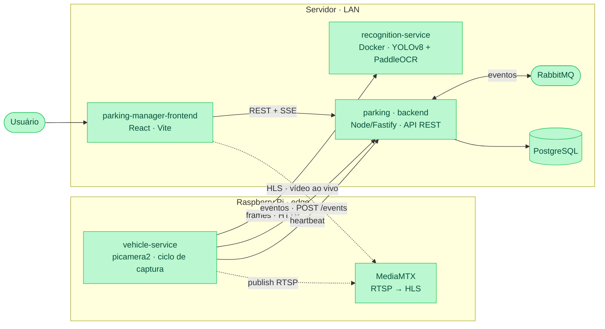

# TCC — Monitoramento de Estacionamento com LPR

Sistema automatizado de monitoramento de vagas de estacionamento baseado em
**visão computacional (LPR — License Plate Recognition / Reconhecimento
Automático de Placas)**, desenvolvido como Trabalho de Conclusão de Curso.

Uma câmera observa o estacionamento; o sistema detecta a presença de veículos,
reconhece a placa, controla a ocupação das vagas em tempo real e expõe tudo num
dashboard web e numa API.

---

## Objetivo

Demonstrar, de ponta a ponta, um sistema de baixo custo capaz de:

1. **Capturar** imagens do estacionamento continuamente a partir de um
   Raspberry Pi com câmera.
2. **Detectar** a presença de veículos (YOLOv8) e **reconhecer a placa** (OCR)
   sem hardware dedicado de LPR.
3. **Gerir o estado do estacionamento** — entrada/saída de veículos, ocupação e
   liberação de vagas, sessões de permanência — aplicando regras de negócio com
   **Domain-Driven Design** e **Clean Architecture**.
4. **Visualizar** a operação em tempo real (ocupação, stream ao vivo da câmera,
   histórico de atividade) num **dashboard web**.

O objetivo acadêmico é mostrar a viabilidade técnica do LPR com hardware
acessível (Raspberry Pi + câmera + um computador comum rodando os modelos) e uma
arquitetura de software desacoplada, testável e evolutiva.

---

## Escopo

**Incluído:**

- Captura de imagem e orquestração do ciclo no edge (Raspberry Pi).
- Detecção de veículo + OCR de placa como serviço HTTP.
- Backend de domínio (estacionamento, vagas, sessões, câmeras, atividade) com
  API REST + eventos assíncronos (RabbitMQ) e persistência (PostgreSQL).
- Dashboard web (mobile-first) consumindo a API.
- Stream de vídeo ao vivo da câmera (RTSP → HLS) para visualização.
- Heartbeat/health das câmeras (online/offline).

**Fora do escopo (por ora):**

- Cancela/cobrança/integração com meios de pagamento.
- Multi-tenant / múltiplos estacionamentos em produção.
- Treinamento de modelo próprio de OCR (usa YOLOv8 + PaddleOCR pré-treinados).
- Alta disponibilidade / deploy gerenciado em nuvem (planejado, não implantado).

---

## Arquitetura



> Legenda: **verde** = implementado e validado. Linha tracejada = stream de vídeo (RTSP/HLS).

---

## Componentes

| Serviço | Stack | Responsabilidade |
|---|---|---|
| **Vehicle Service** | Python, FastAPI, picamera2 | Captura imagem no Pi, consulta o reconhecimento, publica eventos e o stream |
| **Recognition Service** | Python, FastAPI, YOLOv8, PaddleOCR | Detecta veículo e lê a placa (OCR); roda em Docker |
| **Parking (backend)** | Node 20, Fastify, Kysely/Prisma, InversifyJS, PostgreSQL, RabbitMQ | Domínio do estacionamento, API REST, eventos e persistência |
| **Parking Manager (frontend)** | React 19, Vite, TypeScript, React Query, Tailwind | Dashboard web que consome a API |

Cada subprojeto tem seu próprio README com instruções específicas.

---

## Fluxo end-to-end

```
Pi captura frame (a cada N segundos)
  → POST recognition /recognition/frame-presence   (tem veículo? — YOLO)
      → se sim: POST /recognition/spot             (lê a placa — OCR)
  → vehicle publica eventos no parking:
      POST /events  { vehicle.entered | spot.occupied | spot.released | vehicle.exited }
        → parking publica no RabbitMQ + handlers de domínio
        → persiste: parking_sessions, vehicles, parking_spots, activity_events
  → heartbeat periódico: POST /cameras/{id}/heartbeat  (status online/offline)

frontend consome a API:
  GET /parking-lots/:id/map            (ocupação + vagas)
  GET /parking-lots/:id/activity-*     (resumo do dia, feed em tempo real via SSE)
  GET /parking-lots/:id/cameras        (status) + stream HLS ao vivo
```

---

## Como executar

Passo a passo resumido (subir banco/fila, recognition em Docker, backend e
frontend):

```bash
# 1. Banco + fila (em parking/)
cd parking && docker compose up -d

# 2. Recognition (Docker linux/amd64)
cd ../recognition-service
docker build --platform linux/amd64 -t recognition-service:local .
docker run -d --name recognition --platform linux/amd64 -p 9000:9000 \
  -v paddleocr-models:/root/.paddleocr recognition-service:local

# 3. Backend
cd ../parking && pnpm install && pnpm generate && pnpm migrate && pnpm dev   # :3000

# 4. Frontend
cd ../parking-manager-frontend && cp .env.example .env && pnpm install && pnpm dev  # :5173

# 5. Vehicle service: roda no Raspberry Pi (edge)
```

> O `recognition-service` **deve rodar em Docker (linux/amd64)** — o
> `paddlepaddle` trava em inferência nativa no macOS Apple Silicon.

---

## Hardware

- **Raspberry Pi 4/CM4** (Raspberry Pi OS Bookworm 64-bit) — roda o `vehicle-service`.
- **Raspberry Pi Camera Module 3 Wide** (sensor IMX708, captura 4608×2592).
- **Servidor** (Mac/PC) — roda recognition (Docker), backend, banco/fila e frontend na mesma LAN.

---

## Princípios de engenharia

O código segue **DDD**, **Clean Architecture**, **SOLID** e **Object
Calisthenics**: domínio independente de framework, dependências apontando para
dentro, regras de negócio nas entidades/agregados e adapters isolando I/O.
